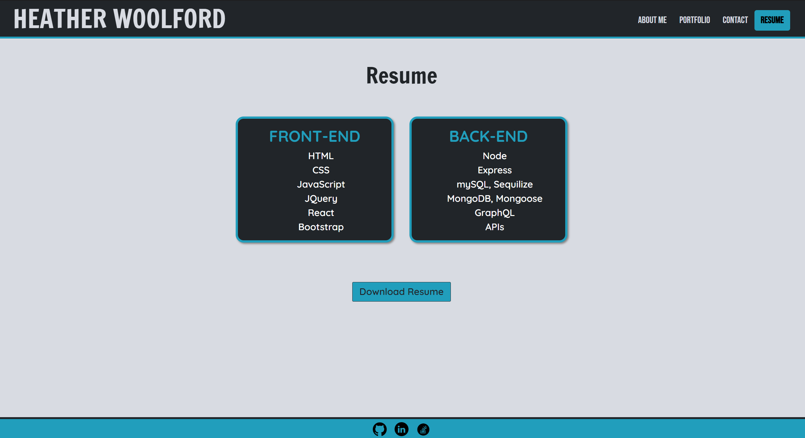

# Professional Portfolio

## Description
This is a professional portfolio app that was built using React and Vite.

## Table of Contents
1. [Usage](#usage)
2. [Instructions](#instructions)
3. [Links](#links)
4. [Acknowledgements](#acknowledgements)
5. [Author](#author)

## Usage
You must have node.js installed on your machine. You will also need a package.json with the required dependencies. Before installing dependencies, run "npm init" to create a package.json file. Then run "npm i" to install dependencies. This app's dependencies are bootstrap, react, react-dom, and react-router-dom. 

## Instructions
1. Clone the repository to your machine
2. Copy the files to your own repository
3. Conduct the git add, commit, and push commands to update your repository with the copied files
4. Follow the Usage instructions above to install necessary dependencies.
5. Modify the code to meet your needs
6. Commit and push your changes

## Links
- [GitHub Repository](https://github.com/hwoolford/professional-portfolio)
- [Deployed Application](https://hwoolford.netlify.app/)

## Acknowledgements
- I would like to acknowledge the assistance provided by Xpert, an AI Learning Assistant, in providing guidance and support throughout the development of this project. Xpert's insights and suggestions were invaluable in helping me overcome challenges and improve the quality of my work. (Acknowledgement written by Xpert)

## Author
My name is Heather Woolford and I am a student learning full stack web development at the University of New Hampshire.
[Find Me on GitHub](https://gist.github.com/hwoolford)